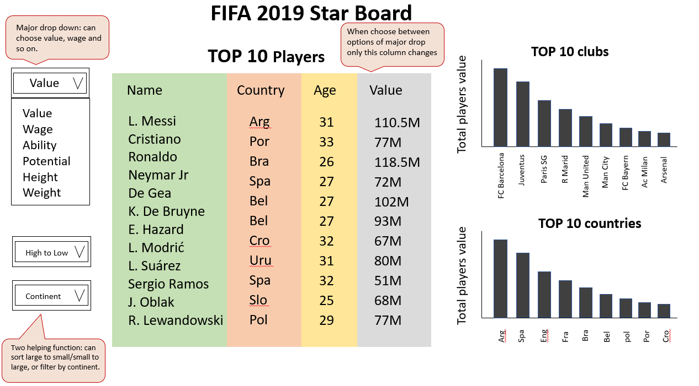

# FIFA Star Board

Group repository for DSCI 532, Group 17

Authors: Yuanzhe Marco Ma, Sicheng Sun, Guanshu Tao, Yuan Xiong

## App Description

This is a dashboard app for football star rankings. The app contains a landing page that shows the top ten players, top ten soccer clubs and top ten countries based on the information that the users want to know. In the main dropdown list, users can choose to rank by player value, player wage, player ability and other options. 
Users can further filter their search by fixing countries, clubs, positions, and so on, or adjust the rank order ascending or descending. 
For example, by choosing 'value', and filter continent as 'europe', a user can learn the top ten most expensive players in Europe, top ten European clubs with the highest total player values, top ten Europe countries with the highest total player values. 

For more detailed usage examples, please see our [proposal](https://github.com/mmyz88/DSCI532_Group17/blob/main/Proposal.md).

